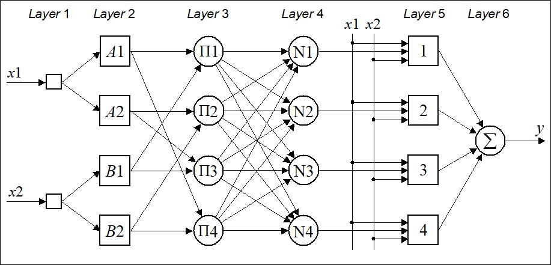
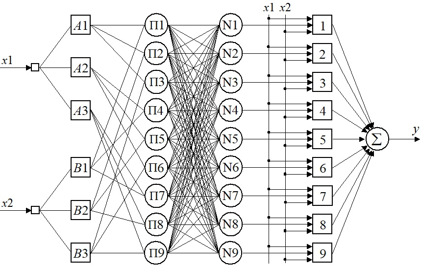
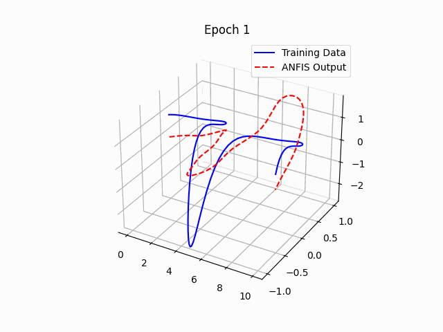

# ANFIS (Adaptive Neuro-Fuzzy Inference Systems)

ANFIS implements Takagi-Sugeno fuzzy rules in a five layer MLP network.

1. The first layer represents fuzzy membership functions
2. The second and the third layers contains nodes that form the antecedent parts in each rule
3. The fourth layer calculates the first-order Takagi-Sugeno rules for each fuzzy rule
4. The fifth layer – the output layer, calculates the weighted global output of the system

Backpropagation is used to modify the initially chosen membership functions and the (LMS) least mean square algorithm determines the coefficients of the linear output functions

 

## Function Approximation

}{e^y}) 

The ANFIS training data includes 101 training samples.  They are represented by a 101 x 3 matrix [x1 x2 yd], where x1 and x2 are input vectors, and yd is a desired output vector.  

The first input vector, x1, starts at 0, increments by 0.1 and ends at 10.  

The second input vector, x2, is created by taking sin from each element of vector x1, with elements of the desired output vector, yd, determined by the function equation.

ANFIS model used contains 9 rules and 3 membership functions

 

## Results

 

